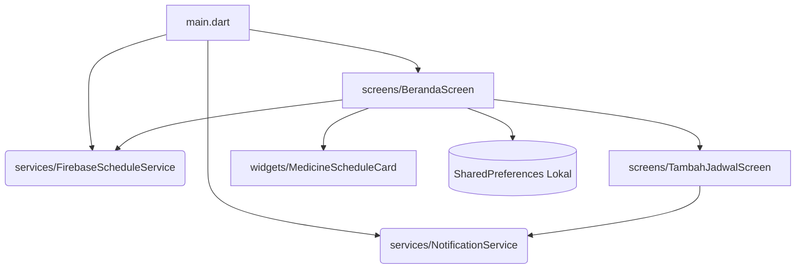

# Dokumentasi Arsitektur

Dokumen ini menjelaskan struktur arsitektural dari aplikasi Smart Medicine Tracker.

## 1. UI-Driven Architecture

Aplikasi ini menggunakan pendekatan **UI-Driven Architecture** (sering disebut arsitektur berbasis *Widget* murni). Pada pola ini, layar UI (Screen/StatefulWidget) bertindak sebagai *Controller* yang menyimpan state aplikasi, menangani *Business Logic*, sekaligus mengontrol *View* (tampilan UI).

**Karakteristik dalam proyek ini:**
*   Tidak ada pemisahan layer yang ketat seperti pada *Clean Architecture* (Domain, Data, Presentation terpisah).
*   *State* dan *Logic* bersatu di dalam class UI (contoh: fungsi logika penyimpanan list obat diletakkan di dalam `_BerandaScreenState`).
*   Ideal untuk prototipe cepat atau aplikasi skala kecil-menengah, meski rentan menjadi *God Object* (class terlalu besar) jika fitur terus bertambah.

## 2. Layer Komponen (Component Layers)

Meskipun tergabung, aplikasi secara implisit membagi fungsinya ke dalam beberapa layer folder:

### A. Screens Layer (`lib/screens/`)
*   **Peran:** Mengelola tampilan *full-page* dan merespon interaksi utama pengguna.
*   **Fungsi Utama:** Menerima input, mengelola urutan data lokal, merubah UI via `setState`.
*   **Komponen:** `BerandaScreen`, `TambahJadwalScreen`.

### B. Widgets Layer (`lib/widgets/`)
*   **Peran:** Menyediakan komponen *reusable* yang lebih spesifik.
*   **Fungsi Utama:** Memisahkan kode UI yang kompleks dari Screen agar kode lebih rapi. Umumnya bersifat `StatelessWidget`.
*   **Komponen:** `MedicineScheduleCard`, `QuickStatCard`, `AdherenceRing`.

### C. Services / Infrastructure Layer (`lib/services/`)
*   **Peran:** Menangani komunikasi dengan modul eksternal, OS, atau jaringan internet.
*   **Fungsi Utama:** Berfungsi sebagai antarmuka API spesifik.
*   **Komponen:** 
    *   `NotificationService`: Komunikasi dengan modul *Local Notifications* di OS Android/iOS dan manajemen *Timezone*.
    *   `FirebaseScheduleService`: Komunikasi ke Google Firebase Cloud.

### D. Theme / Configurations Layer (`lib/theme/`)
*   **Peran:** Pusat standarisasi desain visual aplikasi.
*   **Fungsi Utama:** Menyediakan palet warna, tipografi, dan mode (light/dark) yang terpusat sehingga desain konsisten.

## 3. Dependency Flow (Alur Dependensi)

Arah ketergantungan (dependencies) dalam aplikasi ini mengalir satu arah dari UI ke Service:

**Penjelasan Diagram:**
1.  **Entry Point (`main.dart`)** menginisialisasi layanan penting (Firebase, Notifikasi) sebelum me-load halaman utama (`BerandaScreen`).
2.  **`BerandaScreen`** adalah pusat gravitasi aplikasi. Ia membaca *cache* dari `SharedPreferences`, menampilkan UI menggunakan `MedicineScheduleCard`, dan mengirim perintah sinkronisasi ke `FirebaseScheduleService`.
3.  **`TambahJadwalScreen`** memanggil `NotificationService` untuk membuat *instance* alarm di dalam OS, lalu mengembalikan objek *Map/JSON* ke `BerandaScreen`.

## 4. App Lifecycle

*   `WidgetsFlutterBinding.ensureInitialized()`: Titik mulai, memastikan jembatan (bridge) C++ Flutter berjalan sebelum memanggil fungsi `async`.
*   **Background / Terminated State:** Karena mengandalkan `flutter_local_notifications`, aplikasi dapat berada dalam status *terminated* (ditutup paksa), tetapi OS secara independen akan tetap memunculkan popup pada waktu alarm yang sudah didaftarkan karena alarm didaftarkan ke *AlarmManager* OS.
*   **Data Push:** Pengiriman data ke Firebase terjadi secara sinkron tepat saat pengguna menekan tombol "Simpan" atau "Hapus" di UI, bukan saat aplikasi masuk *background state*. Jika gagal terhubung (tidak ada internet), sinkronisasi data akan tertunda atau bisa hilang kecuali diulangi kembali karena belum ada mekanisme *retry* yang persisten.
