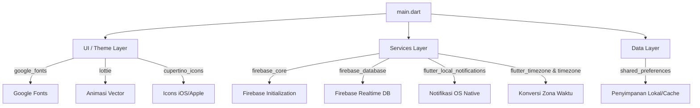
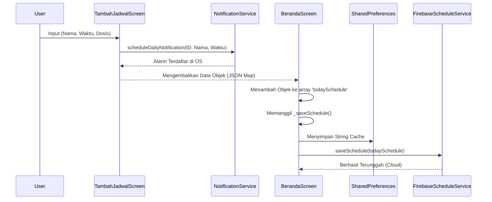

# Peta Dependensi (Dependency Map)

Dokumen ini memetakan relasi antara komponen UI (Visual), proses Service (Backend/OS), dan pustaka pihak ketiga (Packages) dalam bentuk diagram alir dependensi.

---

## 1. Peta Ketergantungan Paket (Package Dependencies Map)

Diagram berikut menunjukkan package `pubspec.yaml` utama mana yang menyokong layar tertentu.

---

## 2. Peta Dependensi Logika Aplikasi (Internal Structure)

Visualisasi bagaimana logika antar file berjalan ketika pengguna menambah jadwal obat (Flow of Control):

---

## 3. Komponen Silang (Cross-cutting Concerns)

Dalam arsitektur software, ada elemen yang memotong secara diagonal ke seluruh struktur aplikasi:

1.  **State Re-rendering (`setState`):** Tidak digambarkan sebagai dependensi spesifik file, namun merambat ke seluruh _Screen_. Jika sebuah input diubah di satu _Screen_, _Screen_ tersebut langsung memanggil render ulang.
2.  **Singleton Pattern (Instance global):**
    *   File `notification_service.dart` menggunakan `NotificationService.instance`.
    *   File `firebase_schedule_service.dart` menggunakan `FirebaseScheduleService.instance`.
    Hal ini memungkinkan komponen UI apa saja (`BerandaScreen` maupun `TambahJadwalScreen`) dapat langsung mengeksekusi layanan eksternal tersebut dari memori yang sama tanpa perlu mendeklarasikan objek `new` (atau inisialisasi awal) berkali-kali di setiap layar yang dapat membuang *RAM* dan membuat bocor memori (*memory leak*).
