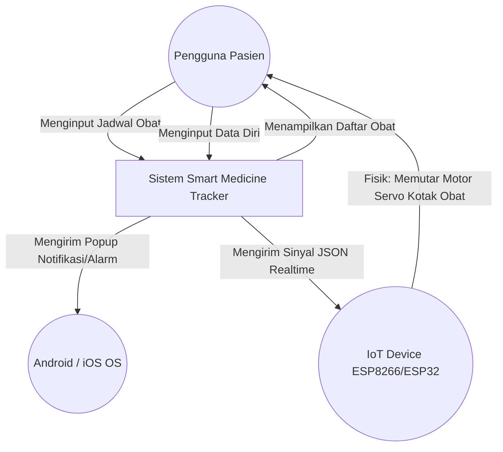
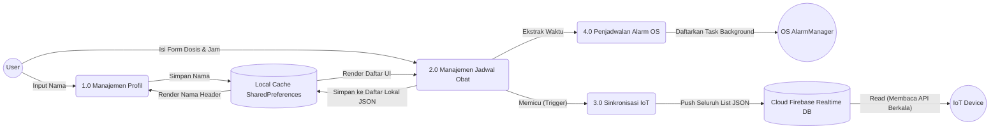

# Data Flow Diagram (DFD)

Berikut adalah visualisasi aliran data proyek Smart Medicine Tracker. DFD sangat penting untuk melihat batasan sistem serta interaksi aktor eksternal ke dalam sistem kita.

---

## 1. DFD Level 0 (Konteks Diagram)

Ini adalah pandangan tingkat tertinggi dari aplikasi (Helicopter View). Sistem aplikasi Smart Medicine Tracker diletakkan di tengah sebagai sebuah proses tunggal yang besar.

---

## 2. DFD Level 1 (Dekomposisi Proses)

Ini adalah pembongkaran sistem menjadi subsistem fungsi. Proses dipecah berdasarkan modul atau fitur utama.

---

## 3. Penjelasan Proses DFD

1.  **Proses 1.0 (Manajemen Profil):** Berjalan pada saat pengguna pertama kali membuka aplikasi. Mengecek *Data Store 1 (Lokal)* untuk eksistensi *key* `userName`. Jika null, memanggil dialog. Jika ada, melanjutkannya ke render teks.
2.  **Proses 2.0 (Manajemen Jadwal Obat):** Merupakan interaksi konstan setiap harinya di halaman utama dan halaman `TambahJadwalScreen`. Tempat terjadinya CRUD data jadwal.
3.  **Proses 3.0 (Sinkronisasi IoT):** Sepenuhnya berjalan tanpa sentuhan tangan *(under the hood)*. Ketika Proses 2.0 sukses memodifikasi *Data Store 1*, fungsi ini aktif dan meneruskan beban yang sama ke *Data Store 2 (Cloud)*. IoT Device (ESP8266) bertugas pasif hanya menarik data tersebut terus-menerus (Polling).
4.  **Proses 4.0 (Penjadwalan Alarm OS):** Menerjemahkan masukan format Waktu UI (Jam dan Menit dari tipe `TimeOfDay`) menjadi format mesin `TZDateTime` (Timezone Unix) dan mendelegasikan tanggung jawab pemunculan banner notifikasi ke *OS Alarm Manager*.
